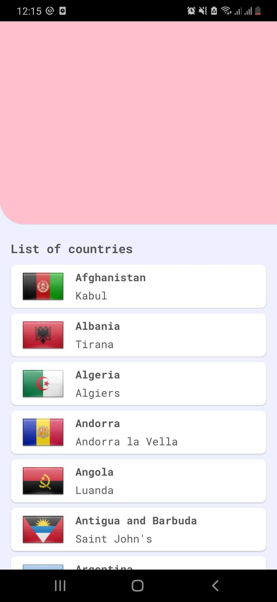
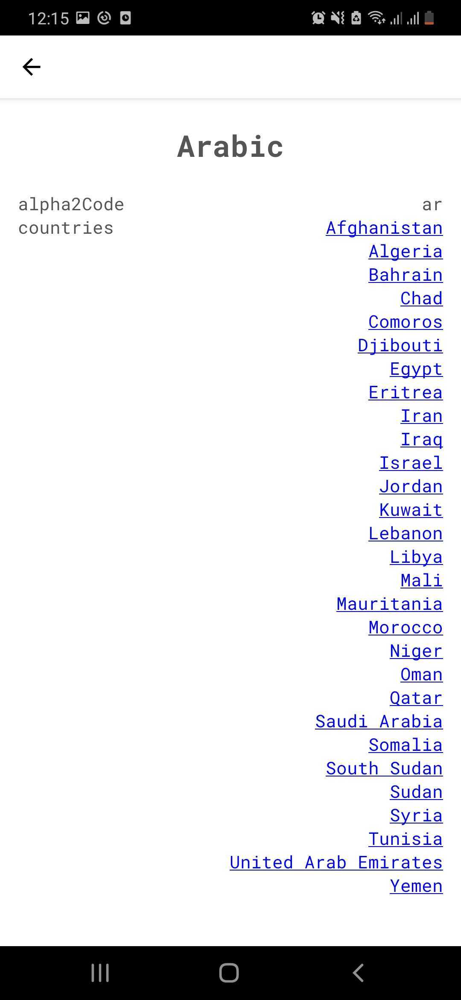

## How to work on this mini-project?

- Clone this repository to your local machine
- Create a repository on your GitHub account and submit the solution there when you're done.
- Send us the URL to your repository via email and we'll contact you with the feedbacks.

**The API editor is at https://www.everbase.co/editor**.

To make it easier to breath, this problem spans across 48 hours. You don't have to make it 100% the same to the images, only the idea. We hope to receive your work in its best shape. Please do not hesitate to ask for more information if neccessary.

# RNHW

You took the role to develop a React Native app which has the following features:

- Show a list of countries

- When user taps on a country, show country screen with a list of languages used in that country

- When user taps on a language, show language screen with a list of countries that use the language

- When user taps on a country on the language screen, show the country screen again
- When user visits [rnhw://country/:id](rnhw://country/:id), show country screen
- When user visits [rnhw://language/:id](rnhw://language/:id), show language screen.

